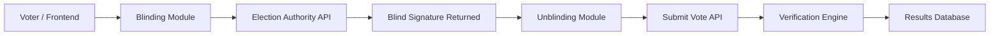
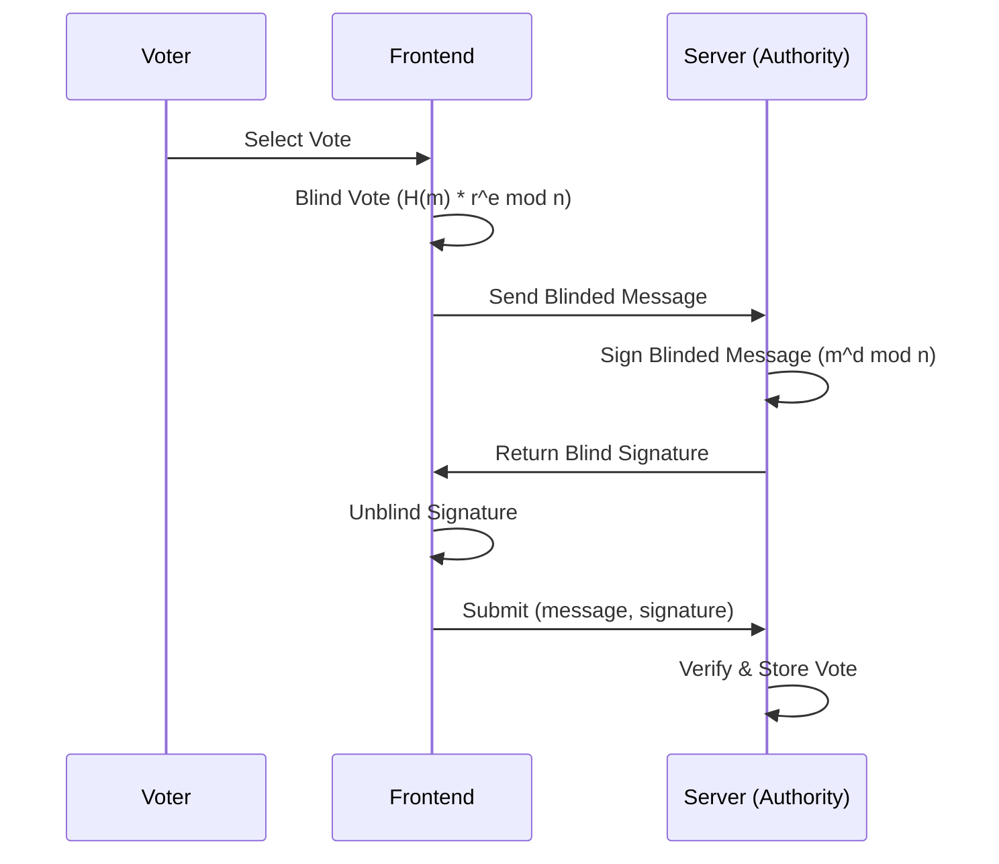

# 🔐 Blind Digital Signatures E-Voting System


---

## 📌 Overview

This project implements a **secure and privacy-preserving electronic voting system** using **Chaum’s Blind Signature Scheme** with RSA cryptography.

The system ensures that:
- Votes are **verified without revealing voter choice**
- The Election Authority cannot link identities to votes
- Each vote is **authentic, private, and tamper-proof**

---

## 👥 Team Members

- Sarita Sangrez (23I-2088)  
- Amna Ali (23I-2067)  
- Fatima Naeem (23I-2046)  
- Rumaisah Haroon (23I-2106)  

**Course:** CS-3002 Information Security  
**Submission Date:** 28/04/2026  

---

## 🏗️ System Architecture

### 📊 High-Level Architecture




## ✨ Features

* 🔐 RSA-based blind signature implementation
* 🧠 Chaum’s anonymous voting protocol
* 🌐 Flask REST API backend
* 💻 Interactive frontend workflow
* 🧪 Attack simulation and testing
* 🚫 Replay protection system
* ✔ Signature verification engine
* 📊 Live results dashboard

---

## ⚙️ System Components

### 1. Cryptographic Core
* RSA key generation (2048-bit)
* Blinding & unblinding operations
* Signature generation & verification

### 2. Backend (Election Authority)
* Flask REST API
* Signs blinded votes without viewing content
* Prevents duplicate voting
* Stores election results

### 3. Frontend (Voter Interface)
* Vote selection system
* Performs blinding locally
* Handles unblinding process
* Communicates with backend APIs

### 4. Security Layer
* Simulated attacks: Replay, Forgery, and Message tampering
* Threat model evaluation

---

## 🧾 Threat Model

### Actors
* **Voter** → Untrusted
* **Election Authority** → Semi-trusted
* **Adversary** → Fully untrusted

### Assets
* Vote confidentiality
* Signature integrity
* Voter anonymity
* Election correctness

---

## ⚠️ Attack Analysis

* **🔁 Replay Attack:** Prevented using token tracking (`used_tokens` set).
* **🧾 Forgery Attack:** Blocked by RSA EU-CMA security.
* **✏️ Message Tampering:** Detected via hash mismatch verification.
* **🕵️ MITM Attack:** Mitigated via secure API communication (TLS-ready design).

---

## 🛠️ Tech Stack

* Python 3.x
* Flask
* PyCryptodome
* Flask-CORS
* HTML, CSS, JavaScript
* REST APIs

---

## 🚀 Setup Instructions

### 1. Install Dependencies
```bash
pip install flask flask-cors pycryptodome requests

Here is the formatted Markdown (`.md`) code for your project documentation. I have cleaned up the layout, structured the endpoints into a clean table, and used proper Markdown syntax for checklists and code blocks to make it highly readable.

```markdown
# 🗳️ Blind Signature E-Voting System

This project demonstrates a full implementation of **Chaum’s Blind Signature Scheme** in an e-voting system, ensuring robust privacy and security guarantees.

---

## 🚀 Setup Instructions

### 1. Install Dependencies
```bash
pip install flask flask-cors pycryptodome requests

```

### 2. Run Backend

```bash
python backend/app.py

```

### 3. Run Tests

```bash
python backend/test_backend.py

```

### 4. Run Frontend

1. Install the VS Code **Live Server** extension.
2. Right-click `frontend/index.html`.
3. Select **Open with Live Server**.

---

## 🔌 API Endpoints

| Endpoint | Method | Description |
| --- | --- | --- |
| `/public-key` | `GET` | Fetch RSA public key |
| `/sign` | `POST` | Sign blinded message |
| `/verify` | `POST` | Verify signature |
| `/submit-vote` | `POST` | Submit vote |
| `/results` | `GET` | Get live results |

---

## 🔐 Security Properties

* **🔒 Confidentiality** → Vote is hidden from authority.
* **🛡️ Integrity** → Tampering invalidates the signature.
* **🧠 Authenticity** → Only the designated authority can sign votes.
* **👤 Anonymity** → The final vote cannot be linked back to the voter.
* **🚫 Replay Protection** → Prevents duplicate voting attempts.

---

## 📊 Performance Summary

* **RSA Signing:** Moderate computation cost (private key operation).
* **Verification:** Fast performance (due to public exponent optimization).
* **Scalability:** Fully functional and optimized for demo-scale elections.

---

## 🧪 Test Results

* [x] Public key retrieval
* [x] Full blind-sign-unblind flow
* [x] Replay attack prevention
* [x] Forged signature rejection
* [x] Message tampering detection
* [x] Multi-voter simulation
* [x] Results aggregation

---

## 📚 References

* Chaum, D. (1982). *Blind Signatures for Untraceable Payments*.
* NIST Cybersecurity Framework 2.0.
* [PyCryptodome Documentation](https://pycryptodome.readthedocs.io/)
* [Flask Documentation](https://flask.palletsprojects.com/)
* Python `secrets` module.

---

## 📌 Summary

This implementation successfully bridges cryptographic theory with a practical web interface, guaranteeing:

* **🔐 Privacy** (via blindness)
* **✔ Integrity** (via verification)
* **🧠 Authenticity** (via RSA signatures)
* **🚫 Replay Protection** (via unique identifiers)

```

```
